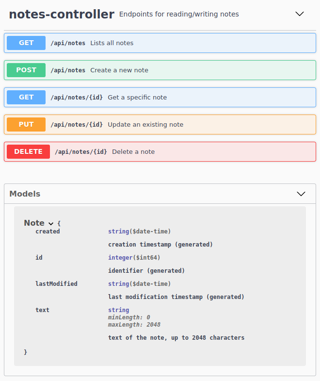

# Example Spring-Boot Project

## Description

Spring boot project with

* **API** (Service, DTO, Exception, Validation)
* **Persistence** (Spring Data JPA & Repository, Liquibase, H2 Database)
* **REST** controller (CRUD)
* **TLS enabled** and properly configured (optionally redirecting HTTP to HTTPS when enabling the HTTP port).
* **Access Log filter**, logging all requests (method, URI, response status and execution time)
* **Performance Logging Aspect**, logging performance tree of nested service calls



## Beginner's tour

A quick tour over the building blocks of the application for beginners (if you're still learning Spring, JPA and REST):

### API

Domain models and service definitions

- `Note`: the domain object of Note with a text. This is a DTO (data transfer object), and will be used in local
  services as well as REST services.
- `NoteService`: the API of the service providing functions to create, update, load and delete notes.
- `ResourceNotFoundException`: a custom exception thrown when a requested note does not exist.

The API contains annotations for **Java Bean Validation** and serialization over **Jackson** (the DTOs will be
serialized as JSON).

### Persistence

JPA persistence to store notes in a relational database

- `BaseEntity`: an abstract base class for entities with an id, version and basic audit information (cretate and updated
  timestamps). Entities are identified by their type and id, and the base class provides proper implementations of
  the `equals`, `hashCode` and `toString` methods.
- `NoteEntity`: the JPA entity for persisting the notes, maps to a database table and attributes to columns.
- `NoteRepository`: a Spring Data JPA Repository providing CRUD (create, read, update, delete) operations. Can be
  extended by adding additional methods to only find specific entities (using JPQL, the criteria API or using semantic
  query method names).

The database used here is a **H2** in-memory database, but could be replaced with another database in
the `application.yaml`.

**Liquibase** is used to create and incrementally build the database schema using the change sets defined
in `src/main/resources/db/changelog`.

### Service

- `NotesServiceImpl`: implementation of the notes service.

### Web

- `NotesController`: exposes the notes service as a REST api.

### Platform

The platform contains auxiliary classes that augment spring with enhanced logging capabilities:

- `AccessLogFilter`: logs the REST API calls (method, path, duration, status). Realized as a **Servlet Filter**. The
  access log is logged in a separate file: `logs/access.log`.
- `PerformanceLoggingAspect`: logs the invocation tree and times for performance analysis. Realized using **AOP**(
  Aspect-Oriented Programming).

Access log output:

```text
2021-09-21 21:34:48.977 - POST /api/notes -> 201 CREATED, 40.80 ms
2021-09-21 21:34:48.991 - GET /api/notes/1101 -> 200 OK, 4.09 ms
2021-09-21 21:34:48.999 - GET /api/notes -> 200 OK, 5.70 ms
2021-09-21 21:34:49.007 - PUT /api/notes/1101 -> 204 NO_CONTENT, 3.62 ms
2021-09-21 21:34:49.012 - GET /api/notes/1101 -> 200 OK, 2.41 ms
2021-09-21 21:34:49.018 - DELETE /api/notes/1101 -> 204 NO_CONTENT, 4.15 ms
2021-09-21 21:34:49.020 - DELETE /api/notes/1101 -> 204 NO_CONTENT, 1.25 ms
2021-09-21 21:34:49.025 - GET /api/notes -> 200 OK, 2.73 ms
2021-09-21 21:34:49.030 - GET /api/notes/1101 -> 404 NOT_FOUND, 3.53 ms
2021-09-21 21:34:49.080 - POST /api/notes -> 400 BAD_REQUEST, 8.51 ms
2021-09-21 21:34:49.125 - POST /api/notes -> 400 BAD_REQUEST, 3.01 ms
```

Performance logging output:

```text
NotesController.update(..) -> 2.13 ms, self: 0.91 ms
  + NoteServiceImpl.save(..) -> 1.22 ms, self: 0.30 ms
    + CrudRepository.findById(..) -> 0.77 ms
    + CrudRepository.save(..) -> 0.15 ms
```

## Build

### Gradle

To build this project with Gradle (default tasks: _clean build install_):

```bash
./gradlew
```

### Maven

To build this project with Maven (default tasks: _clean install_):

```bash
mvn
```

## Run

### Executable JAR

The Spring Boot application can be directly run as an executable jar, which you find in the build folder:

- when built with Gradle: `build/libs`
- when built with Maven: `target`

```bash
java -jar spring-boot-project-1.0.0-SNAPSHOT.jar
```

The task will remain in the `EXECUTING` state to keep the server alive, until it is terminated with _CTRL-C_.

### Gradle

You can also run the application with Gradle:

```bash
./gradlew start
```

### Maven

You can also run the application with Maven:

```bash
mvn spring-boot:run
```

### Setting up TLS

The application uses a **TLS server certificate** issued by a **test CA** (certificate authority). Clients need to trust
this CA in order to connect. The test client already has a properly set up client truststore including this CA
certificate.

When **connecting with other clients** (browser, Postman, ...), you need to add this CA as **trusted root CA** (browser:
certificates, add trusted root certificate). The CA certificate is located in the project root (`test_ca_001.cer`).

## API Documentation (Swagger)

API documentation reachable at [https://localhost:8443/swagger-ui/](https://localhost:8443/swagger-ui/)

## Actuator Endpoints

* Info: [https://localhost:8443/info](https://localhost:8443/info)
* Health: [https://localhost:8443/info](https://localhost:8443/health)
* Metrics: [https://localhost:8443/info](https://localhost:8443/metrics)
